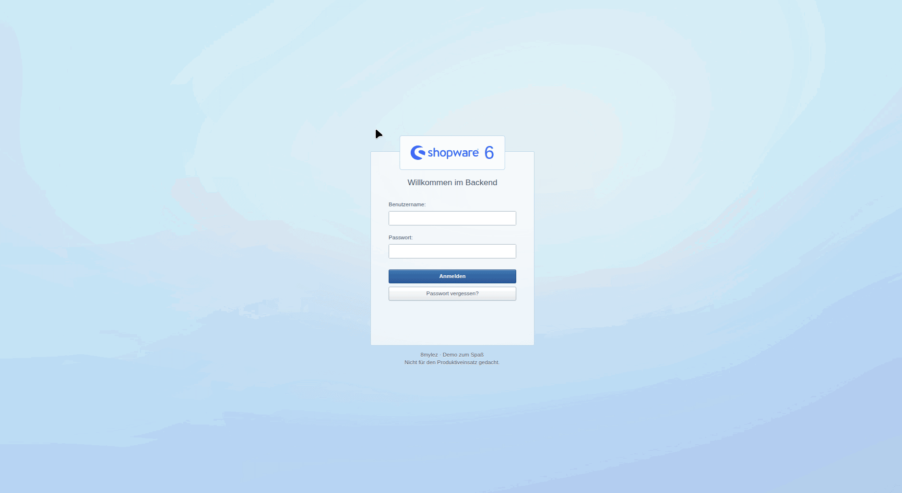
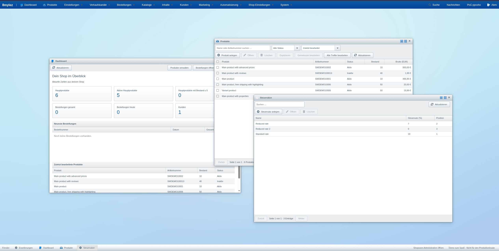
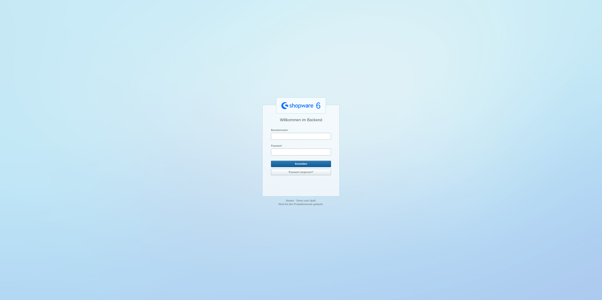
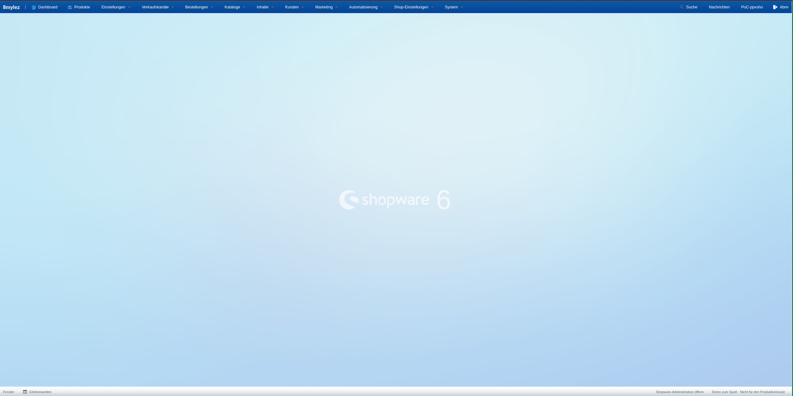
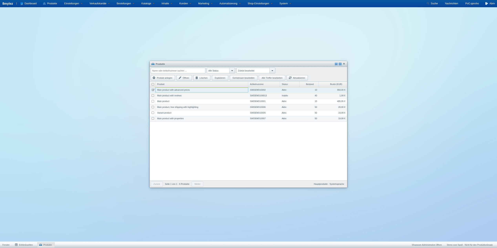
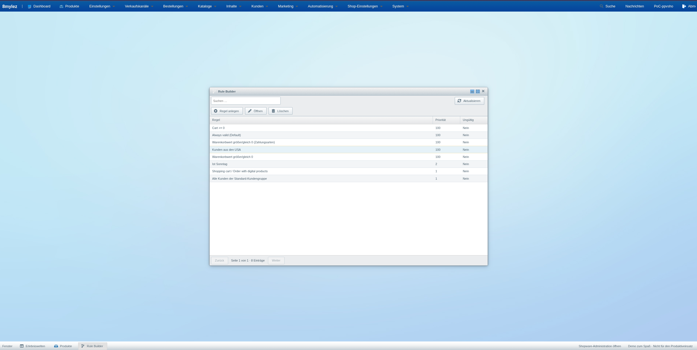
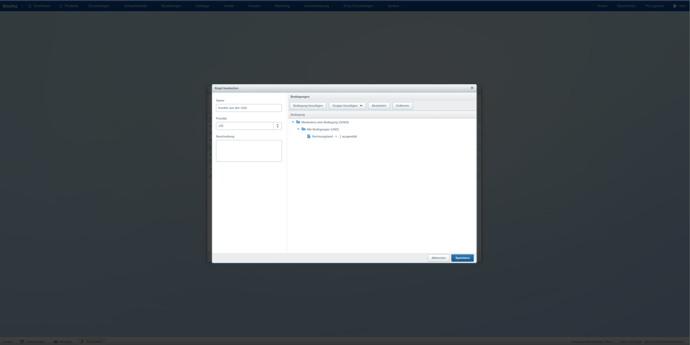

# Ext JS Administration

**Diese Administration ist eine Demo, die aus Spaß am Experimentieren entstanden ist.
Sie ist nicht für den Produktiveinsatz gedacht.**

Eigenständige Ext-JS-Administration für Shopware 6.7.15.0 unter `/admin`.
Die bisherige Administration ist über `/admin?native=1` erreichbar, auch bei einem
konfigurierten abweichenden Admin-Pfad. Das Plugin verändert keine Core-Dateien.

## Demo in Aktion

Kurze Bildschirmaufnahme aus dem Demo-Shop als animiertes GIF.



## Screenshots

### Fensteroberfläche

Dashboard, Produkte und Steuersätze als frei angeordnete Fenster im Demo-Shop.



### Anmeldung

Anmeldeseite mit Shopware-6-Logo und Hinweis auf den Demo-Charakter.



### Desktop

Die Oberfläche mit Hauptmenü, Fensterleiste und Shopware-6-Logo.



### Produkte

Produktübersicht mit Suche, Statusfilter und Aktionen zur Bearbeitung.



### Rule Builder

Übersicht der vorhandenen Regeln mit Priorität und Gültigkeitsstatus.



### Regel bearbeiten

Regelbedingungen lassen sich in verschachtelten UND-/ODER-Gruppen bearbeiten.



## Umgesetzter Umfang

Der Ausbau enthält 73 allgemeine Module bzw. Einstellungsbereiche und zwei zusätzliche
Module für die hier aktiven Plugins `EmzTeamManagement` und `EmzTinkerInstructions`.
Die Tabelle beschreibt die implementierten Funktionen; externe Abhängigkeiten stehen weiter unten.

| Bereich | Implementierte Funktionen |
| --- | --- |
| Anmeldung und Profil | Vorhandene Shopware-Benutzer, Token-Erneuerung, Abmeldung, Shopware-ACL und Standardrechte; eigenes Profil, Passwortänderung, Recovery-Dialog und SSO-Anbindung an Shopwares konfigurierte Anmeldung |
| Desktop | Shopware-5-Fensteroberfläche mit Shopware-6-Logo; globale Suche, Benachrichtigungen und Admin-Worker für Warteschlangen und geplante Aufgaben |
| Dashboard | Produkt-/Bestell-/Kundenkennzahlen, geringer Bestand, heutige Bestellungen, zuletzt bearbeitete Produkte; Rechte werden berücksichtigt |
| Produkte | Anlegen, bearbeiten, löschen, mit Varianten duplizieren; Massenänderungen ausgewählter Produkte oder aller Suchtreffer; Stammdaten, Bestand, Preise, Hersteller, Maße, Garantieangaben, Produktlayout, Suchbegriffe, SEO und Social-Media-Angaben |
| Produktzuordnungen | Kategorien, Tags, Eigenschaften, Zusatzfeld-Sets, Medien/Titelbild, Verkaufskanal-Sichtbarkeiten, private Download-Dateien und Cross-Selling; Übernehmen und Wiederherstellen der Variantenvererbung; Zuordnungen in der Massenbearbeitung ergänzen, ersetzen und entfernen |
| Varianten und Preise | Kombinationen generieren, Ausschlüsse bearbeiten, Listing und Gruppendarstellung konfigurieren; Stammdatenvererbung pro Formularfeld, eigene Werte auch bei Gleichheit zum Hauptprodukt; Währungs-/Einkaufspreise, Streich-/Referenzpreise, Aufschläge und regelbasierte Mengenstaffeln |
| Bestellungen | Suche, Details, Statusübergänge, Belegerzeugung und PDF-/XML-Download, Belegversand mit Anhang; neue Bestellungen über Shopwares Warenkorb; Entwürfe mit Positionen, Versandkosten, Adressen, Kunden- und Zahlungsdaten, Tags und Zusatzfeldern; Neuberechnung, Übernahme und Verwerfen; bestehende Erstattungsaufträge über den Zahlungshandler ausführen |
| Kunden und Kataloge | Kunden/Adressen/Kundengruppen, Hersteller, Kategorien mit Baum, Sortierung und sprachabhängigen internen/externen Linkzielen, Eigenschaften/Ausprägungen, Tags und Bewertungsmoderation; dynamische Produktgruppen mit verschachtelten Filtern und Vorschau |
| Medien | Mehrfach-Upload, Metadaten, Umbenennen, Vorschau/Download, Verschieben, Mehrfach-Löschen, Ordner auflösen und Dateien behalten, Konfigurationsvererbung und Vorschaubildgrößen |
| Erlebniswelten | Seiten/Abschnitte/Blöcke/Elemente, Kopien geschützter Standardseiten, Strukturbaum mit Sortieren und Verschieben, isolierte Layout-Vorschau; 39 Standard-Blöcke und 20 Standard-Elemente aus Shopware 6.7.15.0; statische/dynamische Inhalte, Galerien, Produktgruppen, Videos, Formulare und sprachabhängige Elementkonfiguration; individuelle Inhalte pro Produkt, Kategorie, Landingpage und Kanal-Startseite einschließlich Variantenvererbung |
| Agentur-Inhalte | Teammitglieder mit Bildern; Bastelanleitungen mit Veröffentlichung, Übersetzungen, Schritten, Produkt-/Tag-Zuordnungen und Tag-SEO; beide eigenen CMS-Elemente mit Datenauswahl und Vorschau |
| SEO | Kanalspezifische und globale URL-Vorlagen, Vorschau, manuelle Haupt-URLs und Wiederherstellen der Vorlage unter Erhalt bisheriger Weiterleitungen; Storefront und Headless mit externer Domain |
| Weitere Inhalte | Landingpages mit Verkaufskanal-/Tag-Zuordnungen; zusammengeführte Textbausteine aus Basisdateien und Datenbank, Überschreiben und Zurücksetzen; Theme-Konfiguration, Vererbung, Zuweisung und Kompilierung |
| Marketing | Aktionen, Regeln, Kundenzuordnungen, Sets, Rabattkonfiguration, Währungsbeträge, Codegenerierung und CSV-Download; Newsletter-Empfänger |
| Verkaufskanäle | Stammdaten, Standards und zusätzliche Zahlungsarten/Versandarten/Länder/Währungen/Sprachen; Navigation, Startseite, Domains und Maßsysteme je Kanal/Domain; Produktfeeds mit Twig-Vorlagen, Standardvorlagen, Prüfung, Vorschau und Abruflink |
| Rule und Flow Builder | Verschachtelte Regelbedingungen nach installiertem Schema; Flows mit Ablaufbaum, Verzweigungen und Standardaktionen einschließlich Status, Dokumenten, Mail und Zusatzfeldern; Konfiguration von App-Aktionen |
| Benutzer und Integrationen | Benutzer/Rollen/Rechte, Rollen zuordnen und entziehen, bestätigte Schreibzugriffe, Integration anlegen und Zugang erneuern; Geheimnisse nur bei Erzeugung sichtbar |
| Einstellungen | Steuern/Länderregeln, Lieferzeiten, Einheiten, Anreden, Länder/Bundesländer, Währungen/Rundung, Sprachen, Zahlungs-/Versandarten und Preisstaffeln, Nummernkreise samt Kanalzuordnung/Zählerstand, Suchkonfiguration, wesentliche Merkmale, Statusnamen und Maßsysteme |
| Konfiguration und Betrieb | Globale/kanalbezogene Shop-Konfiguration einschließlich Captcha und Medienauswahl, E-Mail-/Dokumentvorlagen, Zusatzfelder und Übersetzungen, Cache/Indizes, Logs und geplante Aufgaben |
| Import/Export | Profile/CSV-Zuordnung, Probelauf, Import, Export, Verlauf, Abbruch und Download über Shopwares Warteschlange |
| Erweiterungen | Installierte Plugins/Apps, ZIP-Upload, Einlesen, Installieren, Aktivieren, Deaktivieren, Aktualisieren, Deinstallieren und Entfernen; Konfiguration und App-Berechtigungen; Zugang zum offiziellen Shopware Store mit bestehender Sitzung |

Listen suchen und paginieren serverseitig mit 25 Einträgen. Referenzfelder laden
höchstens 25 Suchtreffer; Regelbedingungen werden vollständig in Seiten zu 100 geladen.
Die API prüft alle Rechte serverseitig. Ohne Schreibrechte sind Formulare schreibgeschützt.
Formulare senden bei Änderungen nur bearbeitete Felder. Separate Zuordnungs- und
Inhaltsdialoge speichern jeweils unmittelbar mit ihrem eigenen Speichern-Button.

Die allgemeinen Formulare bearbeiten die Systemsprache; der separate Übersetzungsreiter
speichert gezielt in der gewählten Sprache. Neue Produkte erhalten erst über den Tab
„Verkaufskanäle“ eine Sichtbarkeit. Unbearbeitete Preise in anderen Währungen sowie
Streich- und Referenzpreise bleiben erhalten. Ein reines Bestandsupdate schreibt keine Preise.
Steuer-Auswahl im Produktformular: maximal 100 Steuersätze.

Status-E-Mails und Bestellbestätigungen sind in den jeweiligen Dialogen standardmäßig ausgeschaltet. E-Mail-Vorlagen zu
bearbeiten versendet keine E-Mail. Newsletter-Anmeldung und Kampagnenversand sind
nicht implementiert.

Geschützte CMS-Seiten bleiben schreibgeschützt und können dupliziert werden. Die
CMS-Vorschau zeigt Aufbau und Inhalte; das konkrete Storefront-Theme wird darin nicht
nachgebildet. HTML-Inhalte werden für die Vorschau auf Textformatierung reduziert und
in einem Sandbox-Iframe ohne Skripte dargestellt. Die Vorschau dynamischer Produktgruppen
zeigt höchstens sechs passende Produkte; eine zufällige Storefront-Reihenfolge wird dort
nicht nachgebildet. Für Teamverwaltung und Bastelanleitungen sind eigene Ext-JS-Editoren
vorhanden. Beliebige andere Vue-Komponenten werden nicht automatisch umgewandelt. Der Standardkatalog lässt sich mit
`node custom/plugins/EmzExtAdministration/bin/build-cms-catalog.mjs` aus dem installierten
Shopware-Quellcode neu erzeugen (Node mit `stripTypeScriptTypes` erforderlich).

Regeländerungen und entfernte Bedingungen werden gemeinsam über die Sync-API gespeichert.
Flow-Schritte lassen sich bei deaktiviertem Flow bearbeiten; neue Flows sind inaktiv.
Unbekannte bestehende Aktionskonfigurationen bleiben erhalten. Änderungen an weiteren
Reitern werden jeweils dort gespeichert; ungespeicherte Formulare werden beim Schließen
berücksichtigt.

Für Änderungen an Benutzern, Rollen und Rollenzuordnungen fordert Shopware das aktuelle
Passwort an. Das bestätigte Token wird nur für diese Anfrage verwendet und nicht gespeichert.
Neue Benutzer sind zunächst inaktiv. Rechteabhängigkeiten müssen bei der Rollenkonfiguration
explizit gewählt werden; die Oberfläche zeigt die API-Berechtigungen der installierten Version.

## Externe Abhängigkeiten und Funktionsgrenzen

- Der offizielle Erweiterungs-Store einschließlich Konto, Kauf und Lizenzverwaltung
  öffnet sich in der ursprünglichen Shopware-Administration. Die bestehende Anmeldung
  wird dabei übernommen. Andere Plugin-spezifische Vue-Oberflächen bleiben ebenfalls
  dort erreichbar; ihre automatische Umsetzung nach Ext JS ist nicht enthalten.
- Erstattungsaufträge und Zahlungserfassungen legt die jeweilige Zahlungs-Erweiterung an.
  Ext JS verarbeitet vorhandene offene Erstattungen über Shopwares Endpunkt nach
  ausdrücklicher Betragsbestätigung. Der Test verwendet einen temporären lokalen
  Zahlungshandler ohne Zahlungsdienst und prüft auch die Ablehnung einer Wiederholung.
  Echte Geldbewegungen und kommerzielle Retouren-Erweiterungen sind nicht getestet.
- Externes SSO benötigt eine konfigurierte Shopware-SSO-Anbindung. Geprüft sind
  die Sitzungsübernahme und der Wechsel zur nativen Administration; ein externer
  Identity-Provider ist in diesem Shop nicht eingerichtet.
- Belegarten stammen aus der installierten Shopware-Version. PDF-Erzeugung, Download
  und Mail-Anhang sind geprüft. XML-/ZUGFeRD-Arten benötigen passende Unternehmens-
  und Rechnungsdaten; deren fachliche Validierung ist nicht Bestandteil der Tests.

Die ursprüngliche Shopware-Administration bleibt über `/admin?native=1` erreichbar.
Die Ext-JS-Oberfläche ist primär für Desktop und Tablet ausgelegt.

Die Agentur-Module werden anhand des installierten DAL-Schemas eingeblendet. Die
optionale `TagInstructionExtension` ergänzt ausschließlich die fehlende Rückzuordnung
für Anleitungs-Tags. Beim Löschen entfernt die Verwaltung die zugehörigen Mapping-Zeilen
zusammen mit dem Datensatz über die Sync-API, da das vorhandene Anleitungs-Plugin hier
keine vollständigen Datenbank-Kaskaden besitzt. Der Quellcode von Teamverwaltung und
Bastelanleitungen bleibt unverändert.

## Shopware-5-Gestaltung

Login, Desktop, Menü- und Fensterleisten orientieren sich am ursprünglichen
[Shopware-5-Backend](https://github.com/shopware5/shopware). Originalgrafiken und
Texturen liegen einschließlich Herkunft und Lizenzhinweisen unter
`src/Resources/public/images/shopware5/`. Farben, Schriften, graue Fensterrahmen,
Formulare und kompakte Tabellen sind für Ext JS 7 angepasst.
Login und Desktop zeigen das Logo aus der installierten Shopware-6-Administration
mit Versionsnummer 6; die ursprünglichen Shopware-5-Logos werden nicht verwendet.

Die Module öffnen sich als verschiebbare, skalierbare Fenster.
Minimierte oder geschlossene Fenster lassen sich über Menü und Fensterleiste
wieder öffnen; maximierte Fenster bleiben innerhalb des Desktops.
Die Daten und Benutzerrechte stammen weiterhin aus Shopware 6.

## Ext-JS-Version und Lizenz

Verwendet wird **Ext JS 7.0.0 GPLv3, Classic Toolkit, Triton Theme**. Laut
[Sencha](https://www.sencha.com/legal/open-source-faq/) ist 7.0 die letzte GPL-Ausgabe.
Die neuere [Community Edition](https://www.sencha.com/products/extjs/communityedition/)
setzt Registrierung und die dort genannten Umsatz-/Teamgrenzen voraus.

Diese Administration steht unter GPL-3.0-only; siehe `LICENSE`. Bei Weitergabe sind die
GPL-Bedingungen einschließlich des zugehörigen Quellcodes zu berücksichtigen.
Das ursprüngliche Projekt und andere Plugins werden durch diese Datei nicht neu lizenziert.
Die unveränderten Sencha-Lizenzhinweise werden neben dem SDK installiert.
Für die übernommenen Shopware-5-Grafiken gelten die mitgelieferten ursprünglichen
Lizenzhinweise; siehe `images/shopware5/NOTICE.md` unter den öffentlichen Ressourcen.
Der vollständige SDK-Quellcode ist im [Originalarchiv](https://cdn.sencha.com/ext/gpl/ext-7.0.0-gpl.zip) enthalten.

## Installation

Python ≥ 3.11 für den SDK-Installer; kein Sencha-Konto, npm-Build oder Sencha Cmd erforderlich.
Die SDK-Dateien sind generierte Abhängigkeiten und werden nicht eingecheckt.

```bash
python3 custom/plugins/EmzExtAdministration/bin/install-sdk.py
ddev exec php bin/console plugin:refresh
ddev exec php bin/console plugin:install --activate EmzExtAdministration
ddev exec php bin/console assets:install
ddev exec php bin/console cache:clear
```

Ein vorhandenes Archiv kann mit `--archive /pfad/ext-7.0.0-gpl.zip` installiert werden.
Der Installer prüft die gepinnte SHA-256-Prüfsumme und entpackt nur benötigte Laufzeitdateien.
JavaScript und CSS werden lokal ausgeliefert, ohne CDN-Anfragen im Browser.
Nach Änderungen an `src/Resources/public/` erneut `assets:install` ausführen.

Im Plugin `EmzCustomerNumberLogin` werden `php-http/discovery` und `symfony/runtime`
unter `config.allow-plugins` ausdrücklich deaktiviert. Dessen vorhandenes eigenes
`vendor`-Verzeichnis führte beim Einlesen der Plugin-Metadaten sonst zu einem
`PluginBlockedException` und verhinderte ZIP-Uploads und `plugin:refresh`.
Die Einstellung erlaubt keine Ausführung dieser Composer-Plugins; siehe
[Composer: allow-plugins](https://getcomposer.org/doc/06-config.md#allow-plugins).

## Tests

```bash
node --test --test-isolation=none custom/plugins/EmzExtAdministration/tests/*.test.js
cp custom/plugins/EmzExtAdministration/tests/acceptance/ext-administration.spec.ts tests/acceptance/tests/ext-administration.spec.ts
cd tests/acceptance
npx playwright test tests/ext-administration.spec.ts --workers=1
```

Die Befehle starten im Shopware-Projektverzeichnis. Die Browserfälle sind im Plugin
unter `tests/acceptance/` versioniert und werden in das Testprojekt des Shops kopiert.
Ihre Pfade setzen die Plugin-Installation unter `custom/plugins/EmzExtAdministration`
voraus. Das Testprojekt benötigt Playwright mit Chromium, `APP_URL` als `baseURL` und
die unten genannten Zugangsdaten aus seiner lokalen `.env`. Die DDEV-/Mailpit- und
Agentur-Plugin-Tests sind auf den hier beschriebenen lokalen Demo-Shop zugeschnitten.

Die Browsertests nutzen `APP_URL` und `SHOPWARE_ADMIN_USERNAME`/`SHOPWARE_ADMIN_PASSWORD`
aus der bestehenden Testkonfiguration. Sind keine Benutzer-Zugangsdaten gesetzt,
legen sie über die konfigurierte Test-Integration einen temporären Admin-Benutzer an.
Testbenutzer sowie die jeweils angelegten Produkte, Kategorien, Kunden, Hersteller, Steuersätze,
Medien, Regeln, Erlebniswelten, Währungen, Flows und Bestellungen werden wieder gelöscht. Nur gegen einen lokalen Testshop ausführen.

Die normale Anmeldesitzung liegt im `sessionStorage` des aktuellen Tabs. Passwörter werden
nicht gespeichert. Beim bewussten Wechsel zur nativen Administration wird deren
standardmäßiges `bearerAuth`-Cookie am Admin-Pfad verwendet und beim Zurückwechseln
wieder entfernt; Zugangstokens stehen dabei nie in der URL. Abmelden entfernt die lokale Sitzung und ruft Shopwares Logout-Endpunkt auf;
dieser widerruft die Benutzertokens auch für weitere Sitzungen.

Der Testumfang umfasst 70 Browserfälle und 40 Node-Tests. Die Browserfälle prüfen
alle 75 hier verfügbaren Module auf API-/Browserfehler und zentrale Schreibabläufe mit
anschließendem Lesen aus Shopware. Dazu gehören echte Flow-Ausführung, Recovery mit
verbrauchten Einmallinks, CSV-Import/Export über die Queue, Varianten und Vererbung,
CMS-Inhalte, Storefront-/Headless-SEO, Bestellentwürfe, Rechnungsanhänge in Mailpit,
Erstattungen mit lokalem Testhandler und ZIP-Installation samt Update von 1.0.0 auf 1.0.1.
Die Node-Tests prüfen unter anderem Token-Rennen, unveränderte Payloads,
Preis-/Vererbungsregeln, Variantenausschlüsse und CMS-Konfiguration.
Nicht jede mögliche Feld-, Rollen-, Erweiterungs- oder Zahlungsanbieter-Kombination
wird durch diese Tests abgedeckt.

Prüfstand 07.10.2026: Der vollständige Browserlauf mit damals 69 Fällen war erfolgreich.
Nach der Ergänzung übersetzter Kategorie-Linkziele bestanden auch der neue Fall und
die beiden betroffenen Regressionstests für Kategorien und Produktübersetzungen.
Alle 40 Node-Tests sowie JavaScript-/PHP-Syntax, Twig- und Container-Prüfung waren erfolgreich.
Die Oberfläche wurde bei 1440 × 1000 und 1024 × 768 Pixeln geprüft.

Für lokale Mailtests nutzt dieser DDEV-Shop `MAILER_DSN` mit Mailpit unter
`127.0.0.1:1025`. Der zuvor gesetzte Wert `core.mailerSettings.emailAgent=local`
verwendete stattdessen ein hier nicht funktionierendes sendmail. Er wurde lokal geleert,
damit Shopware den vorhandenen SMTP-Transport verwendet. Die Tests prüfen vorher den
lokalen Transport, senden ausschließlich an eigene Testadressen und entfernen ihre Mails.
Es wurde kein externer Mailversand getestet.

## Rückbau

```bash
ddev exec php bin/console plugin:deactivate EmzExtAdministration
ddev exec php bin/console cache:clear
```

Danach lädt `/admin` wieder die Shopware-Administration. Es gibt keine eigenen Tabellen oder Migrationen.
